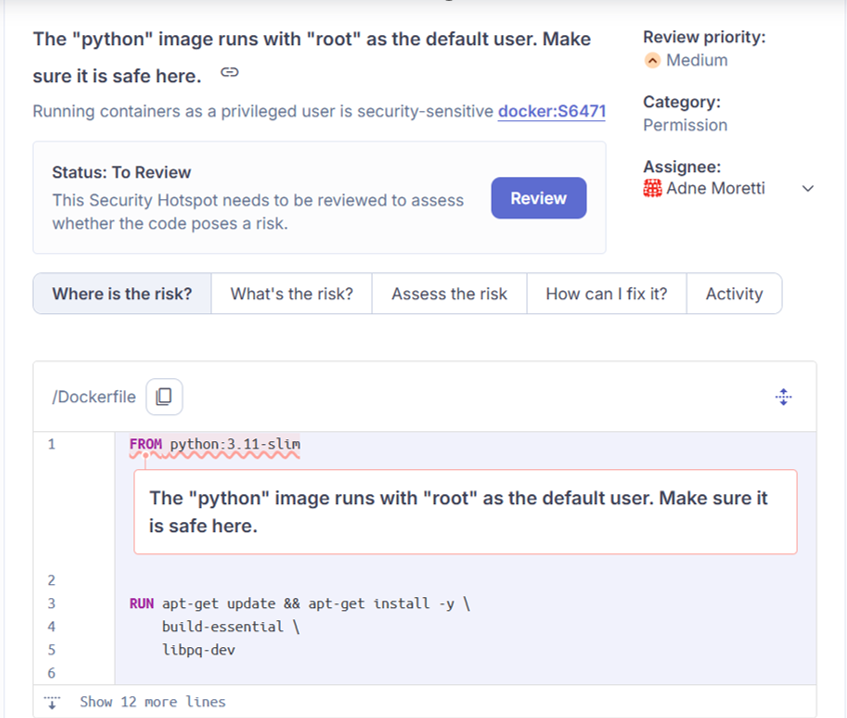

# Containerização

### Back-End

Para viabilizar a containerização da aplicação, foi criado um arquivo Dockerfile\
responsável por empacotar o BackEnd da aplicação, além do docker-compose.yml\
que orquestra a execução conjunta dos serviços necessários, como banco de dados e\
servidor da aplicação que são executados em container.&#x20;

Durante o desenvolvimento dessa boa prática, o SonarQube identificou alguns problemas nas primeiras versões desenvolvidas, o que fez com que os autores aplicassem boas práticas de containerização segura.&#x20;

A primeira versão desenvolvida para o _Back-End_ foi:&#x20;

```docker
FROM python:3.11-slim

WORKDIR /app/

ENV PYTHONPATH=/app

RUN apt-get update && apt-get install -y \
build-essential \
libpq-dev

RUN pip install --upgrade pip

COPY requirements.txt requirements.txt
RUN pip install -r requirements.txt

COPY . .

CMD ["fastapi", "run", "--workers", "4", "app/main.py"]
```

Ao abrir o PR para a aplicação, o SonarCloud identificou algumas possíveis vulnerabilidades no conatiner desenvolvido. Vulnerabilidades essas que podem ser visualizadas nas figuras a seguir:&#x20;

<figure><figcaption></figcaption></figure>

<figure><figcaption></figcaption></figure>

As vulnerabilidades encontradas explicitam que a Figura do python executa como\
padrão pelo usuário root e pode permitir acessos indevidos em caso de ataque de\
segurança . Sendo assim, com as boas práticas em container previamente adotadas\
aninhadas com os alertas do SonarCloud, foram implementadas as seguintes práticas\
de container que deixam a imagem mais modular e segura:&#x20;

* Imagens docker menores: Segundo Shaji (2024), imagens menores tendem a ser\
  mais seguras, pois incluem apenas as bibliotecas necessárias e dependências de\
  sistemas necessárias para rodar a aplicação;
* Utilizar de container sem privilégios: Segundo Shaji (2024), Docker roda container como root por padrão, mas é uma prática não adequada. Dessa forma, se um atacante consegue acessar o container, vai ter privilégios de root e pode performar ataques contra o host docker, e
* Utilize um .dockerignore: Esse arquivo é utilizado para especificar as pastas\
  e os arquivos que não se deseja adicionar ao build inicial do container;
* COPY de forma não recursiva: Não copiar toda a aplicação para o container Docker, mas especificar os arquivos e as pastas que deseja copiar para que não adicione segredos e senhas indesejadas no container.

O que resultou no seguinte arquivo:&#x20;


```docker
FROM python:3.11-slim

RUN apt-get update && apt-get install -y \
    build-essential \
    libpq-dev \
    && rm -rf /var/lib/apt/lists/*

COPY requirements.txt requirements.txt
RUN pip install --upgrade pip && pip install -r requirements.txt && addgroup --gid 1001 --system app && \
    adduser --no-create-home --shell /bin/false --disabled-password --uid 1001 --system --group app

USER app

WORKDIR /app

ENV PYTHONPATH=/app

COPY app/ ./app/
COPY scripts/ ./scripts/
COPY .env .env

CMD ["fastapi", "run", "--port", "8001", "--host", "0.0.0.0", "app/main.py"]
```


Após aplicação das mudanças, a análise do SonarQube indicou alterações seguras:&#x20;

<figure><figcaption></figcaption></figure>

Ao utilizar o Docker Compose, cada serviço descrito no arquivo — como o backend\
ou o banco de dados — é executado em containers separados. O Docker Compose permite que o build e a execução desses serviços sejam realizados de forma integrada e coordenada, simplificando o gerenciamento e a orquestração dos containers, o arquivo de configuração foi:&#x20;


```yaml
  services: 
    db: 
      image: docker.io/postgres:15-alpine
      volumes: 
        - customer_db:/var/lib/postgresql/data/pgdata
      env_file: 
        - .env
      ports:
        - 5432:5432
      networks: 
        - tcc-network
        
      prestart:
        build:
          context: .
          networks:
            - tcc-network
          depends_on:
            - db
          command: sh scripts/prestart.sh
            env_file:
              - .env
        
      backend: 
        build:
          context: .
        ports: 
          - 8000:8000
        networks:
          - tcc-network
        depends_on: 
          - db
        env_file: 
          - .env  
        
  volumes: 
    customer_db:
        
  networks:
    tcc-network: 
    driver: bridge
```


O arquivo ficou dividido em 3 containers diferentes, um representando o banco de dados da aplicação, a aplicação e outro que roda os arquivos de migração inicial do banco, com os comandos definidos no pre-start.sh. Todos os containers rodando sobre a mesma rede tcc-network para viabilizar a comunicação.&#x20;


***

### Front-End

Para o Front-End da aplicação, uma situação de erro semelhante ocorreu na análise\
do Dockerfile pelo Front-End, que recebeu o feedback:

<figure><figcaption></figcaption></figure>

E o seguinte arquivo final:&#x20;


```docker
FROM node:20
    
COPY frontend/package*.json ./
            
RUN npm ci
    && addgroup --gid 1001 --system app && \
    adduser --no-create-home --shell /bin/false
    --disabled-password --uid 1001 --system --group app
            
USER app
            
WORKDIR /app
            
COPY frontend/ .
            
EXPOSE 3000
            
CMD ["npm", "start"]
```


O docker-compose da aplicação ficou com a seguinte configuração:&#x20;


```yaml
services:
  frontend:
    build: .
      ports:
        - "3000:3000"
      environment:
        - CHOKIDAR_USEPOLLING=true
      volumes:
        - ./frontend:/app
```


Também foi criado um _.dockerignore_ para que o build do Docker ignore arquivos que podem conter informações sensíveis e indesejadas.&#x20;

