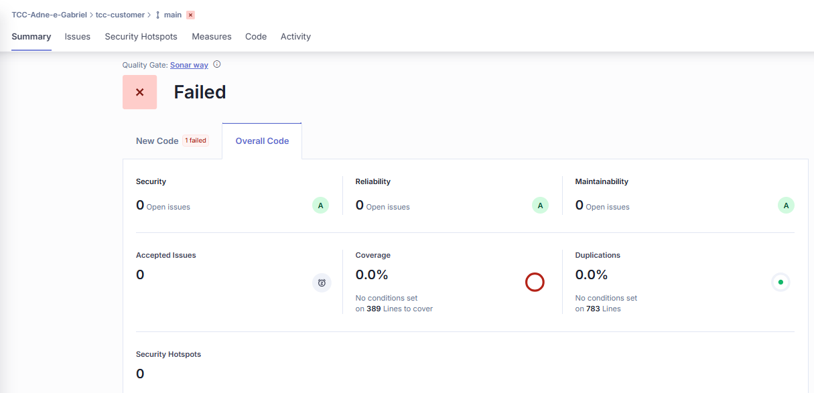

# Análise de Resultados

### ORM e Validação de Dados

A validação de dados de entrada e saída é um aspecto essencial de aplicações seguras e robustas, pois em aplicações que utilizam de Interface de Aplicação, é comum\
que parte das entradas venham de fontes externas e não confiáveis. Sendo assim, é importante que os dados sejam recebidos conforme o esperado. Isso reduz significativamente a\
superfície de ataque, impedindo que dados malformados ou maliciosos avancem para camadas mais profundas da aplicação, onde poderiam causar falhas; inconsistências lógicas,\
ou mesmo abrir brechas para exploração de vulnerabilidades como injeções ou corrompimento de fluxo.

Além disso, a validação dos dados de saída é fundamental para que o sistema tenha\
um escopo de retorno, minimizando o risco de vazar informações sigilosas.\
Segundo (COOKIES, 2024), utilização de um Object Relational Mapper também\
pode colaborar com a segurança do serviço, ao prover mecanismos para prevenir problemas\
de segurança de SQL Injection, abstraindo queries em SQL.

A aplicação da primeira boa prática prevista na Prova de Conceito já eliminou\
os problemas de segurança anteriormente mapeados nos serviços, mantendo apenas os\
Security Hotspots relacionados a Token exposto e criptografia. No painel do SonarQube, após alterações, é possível visualizar que os únicos problemas\
encontrados são relacionados à repetição de trechos de código, com o texto: "Define a\
constraint instead of duplicating this literal "User not found" 3 times", problema que foi\
resolvido em posterior mudança.

<figure><figcaption></figcaption></figure>

Fonte: Autores. Ferramenta: SonarSource (2025a).

### BCrypt

Visando melhorar a segurança do sistema, no sistema de usuários, foi realizada a substituição do MD5 pelo algoritmo Bcrypt, uma função de hash projetada especificamente para armazenar senhas de forma segura. O Bcrypt torna o processo de geração de hash mais lento, dificultando significativamente ataques por dicionário ou força bruta. Com essa alteração, o sistema passa a seguir boas práticas de segurança, oferecendo maior proteção aos dados sensíveis dos usuários.

A aplicação dessa boa prática reduziu a quantidade de Hotspots para dois. O SonarQube identificou que o Bcrypt é um algoritmo de hash seguro. As Figuras a seguir apresentam análise do SonarCloud após implantação da boa prática, com notas e quantidade de problemas encontrados, mostrando apenas 2 Hostpots de Segurança e 3 de Manutenabilidade, sem problemas de segurança.

<figure><figcaption></figcaption></figure>

Fonte: Autores. Ferramenta: SonarSource (2025a).

De forma detalhada os HotSpots de segurança encontrados, mostrando que o HotSpot de segurança foi resolvido automaticamente pelo SonarQube, e que a mudança de algoritmo de criptografia trouxe melhorias para a Segurança do sistema.

<figure><figcaption></figcaption></figure>

Fonte: Autores. Ferramenta: SonarSource (2025a).

### JWT e OAuth

Como última prática adotada na Prova de Conceito, a utilização de Json Token Web e o protocolo de autorização OAuth2 também representam ganhos em relação à vulnerabilidade A01 Broken Access Control, limitando o acesso de usuários não autorizados. As vantagens com a aplicação da boa prática são:

* **Integridade dos dados:** Cada JWT é criptograficamente assinado, o que significa que clientes ou partes mal-intencionadas não podem modificar o conteúdo JSON;
* **Token Autocontido e Verificável:** Pela garantia e expiração, outros sistemas não precisam consultar o serviço de usuários para verificar permissões, o que reduz latência nas requisições de serviços distribuídos, e
* **Gerenciamento Seguro de Fluxos de Autorização:** OAuth é descrito como uma maneira segura de gerenciar fluxos de autorização.

### Conclusão

Seguem imagens dos resultados das aplicações da PoC aos serviços de usuários, produtos e pedidos, respectivamente:

<figure><figcaption></figcaption></figure>

Fonte: Autores. Ferramenta: SonarSource (2025a).

<figure><figcaption></figcaption></figure>

Fonte: Autores. Ferramenta: SonarSource (2025a).

<figure><figcaption></figcaption></figure>

Fonte: Autores. Ferramenta: SonarSource (2025a).

O SonarQube falha ao observar que não existe cobertura de testes para os serviços, porém, apesar de grande importância para segurança e redução de falhas nos sistemas, os diferentes tipos de testes não foram incluídos no desenvolvimento do trabalho.

Ao final da aplicação da Prova de Conceito 2, a nota estabelecida pelo SonarQube foi de E para A, sem apresentar problema algum de segurança, ou Hotspot de Segurança. Sendo assim, os autores concluíram que a aplicação das boas práticas anteriormente descritas causaram grande impacto na construção de aplicações mais seguras.
