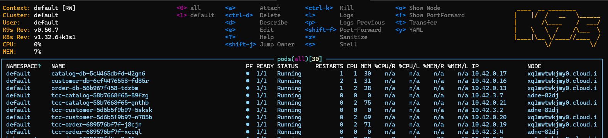

# Análise de Resultados

### Kubernetes

Com a utilização do Kubernetes para orquestração de Containers, alcançou-se um resultado muito satisfatório, de forma que a aplicação se encontra em serviços Kubernetes. Sendo assim, pode ser distribuída em uma ou mais réplicas, que rodam em diferentes máquinas.

A figura a seguir apresenta a visualização dos serviços da aplicação no _cluster_, utilizando-se da ferramenta do k9s (K9S, 2025). Na figura, é possível visualizar que o Banco de cada um dos serviços está rodando em apenas uma instância, para maior simplicidade nos testes; enquanto que cada um dos serviços do _Back-End_ está rodando com 2 réplicas, em máquinas diferentes do _cluster_, que é apresentada no campo _NODE_ da tabela. Dessa forma, se uma das máquinas falhar, o serviço continua a responder. Além disso, se o _cluster_ possuir recursos, o _pod_ é realocado para outro nó.

<figure><figcaption></figcaption></figure>

Fonte: Autores.

Com a utilização de Kubernetes torna-se mais fácil a escalabilidade entre máquinas do _cluster_; a recuperação automática de falhas, e o gerenciamento de redes e volumes. A depender da quantidade de réplica de serviços, é possível obter um sistema muito mais escalável, disponível e robusto.

### Conexão com TLS

A aplicação de TLS deixou o site mais seguro e acessível por HTTPS. Foi possível realizar uma  requisição feita pelo _curl_ para um serviço por meio do subdomínio da API do sistema, que fez verificação se o sistema possui certificado válido. Esse fluxo apresentou um bom resultado, confirmando a validade do certificado e comprovando a funcionalidade do HTTPS e a integridade da comunicação externa.

### API Gateway

A API Gateway proporciona um ponto único de entrada, com roteamento inteligente que assegura que as requisições cheguem ao serviço correto, mesmo em arquiteturas com múltiplas versões ou microsserviços, abstraindo a arquitetura mais complexa para clientes que utilizam da API. Adicionalmente, tem-se um único ponto de entrada para o sistema, possibilitando a aplicação de configurações de segurança em um só lugar.

### Conclusão

Com o desenvolvimento da PoC 3, foi possível observar ganhos em relação às seguintes vulnerabilidades da _OWASP Top Ten_:

* **A04 - Insecure Design**;
* **A05 - Security Misconfiguration**;
* **A08 - Software and Data Integrity Failures**;
* **A10 - Server-Side Request Forgery**;
* **A02 - Cryptographic Failure**, e
* **A03 - Injection**.

Obtendo, diante da análise dos autores, um resultado satisfatório para a segurança do projeto.

