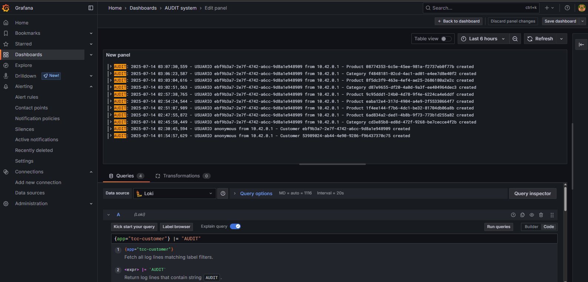

# Coleta e Filtro de Logs

A ferramenta utilizada para a implementação da boa prática de Coleta e Filtro de Logs foi o Grafana Loki (STACK, 2025) um sistema de coleta de logs de código aberto, capaz de armazenar, consultar e visualizar logs. Em conjunto com essa ferramenta, também foi utilizado o PromTail, responsável por coletar os logs gerados nos pods da aplicação e enviá-los para o Loki.

Ao integrar com o Grafana, torna-se possível visualizar os logs emitidos por cada um dos pods do sistema. Também é viável a criação de dashboards com filtros específicos, permitindo um acesso facilitado aos logs desejados.

Para os serviços desenvolvidos, foram criados dois dashboards distintos: um dedicado aos logs de auditoria do sistema e outro para os logs gerais, com o objetivo de facilitar a consulta às informações.

A figura a seguir apresenta o dashboard de auditoria configurado para o sistema, no qual os logs são filtrados pela palavra "AUDIT", exibindo as ações realizadas com as informações necessárias. O filtro é feito pelo código `app=«nome-do-app > |= "AUDIT"`, que filtra logs do app que tem o texto "AUDIT". Para esse dashboard, foram criados filtros para cada um dos serviços.

<figure><figcaption></figcaption></figure>

Fonte: Autores. Ferramenta: Grafana (2025).

Já a figura a seguir apresenta todos os logs dos microsserviços que estão rodando, incluindo logs de erros e detalhes de exceções lançadas.

<figure><figcaption></figcaption></figure>

Fonte: Autores. Ferramenta: Grafana (2025).

