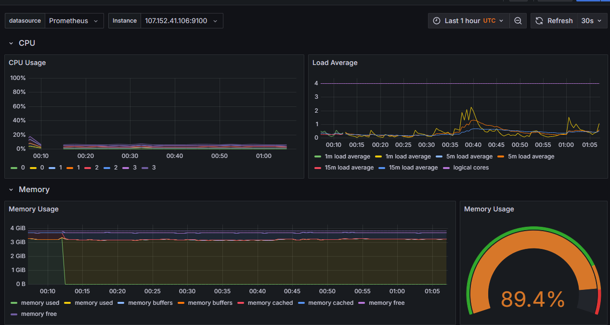

# Coleta e visualização de métricas

Para monitoramento e visualização de métricas nos sistemas os autores optaram pelo uso do Prometheus, responsável pela coleta de métricas, e do Grafana, utilizado para a criação de dashboards e visualização dessas métricas. Para isso, com o cluster Kubernetes já configurado, foi necessária a instalação da ferramenta **kube-prometheus-stack**, que integra a coleta de métricas pelo Prometheus com a visualização no Grafana.

Aós a instalação, foi preciso alterar a exposição dos pods do Prometheus e do Grafana para uma porta externa, permitindo o acesso às interfaces e visualização. Tal exposição da porta foi feita ao alterar a configuração dos pods de ClusterIP (acessível apenas internamente) para NodePort (acessível interna e\
externamente)

O Prometheus, quando foi instalado via helm, que é um gerenciador de pacotes para aplicações Kubernetes, automaticamente coleta métricas dos nós do cluster Kubernetes, obtendo dados relacionados à saúde de cada nó, como uso de CPU, memória e média de carga do sistema.

Visualização de métricas dos nodes no Grafana após ter pods de monitoramento rodando:&#x20;

<figure><figcaption></figcaption></figure>

&#x20;                                                    Fonte: Autores. Ferramenta: Grafana

Visualização de métricas por pod no Grafana:&#x20;

<figure><figcaption></figcaption></figure>

&#x20;                                                    Fonte: Autores. Ferramenta: Grafana

### Referências

GRAFANA. Grafana OSS and Enterprise | Grafana documentation. 2025. Disponível\
em: [https://grafana.com/docs/grafana/latest/](https://grafana.com/docs/grafana/latest/)

PROMETHEUS. Prometheus - Monitoring system & time series database. 2025.\
Disponível em: [https://prometheus.io/](https://prometheus.io/)

