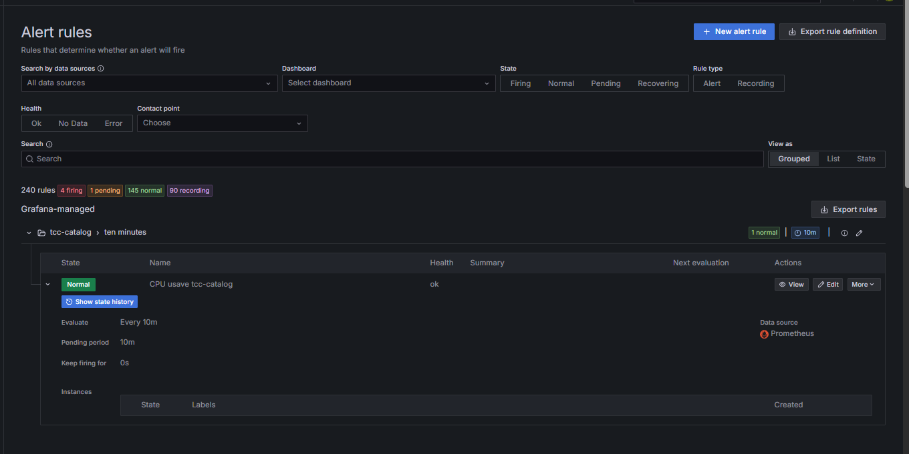
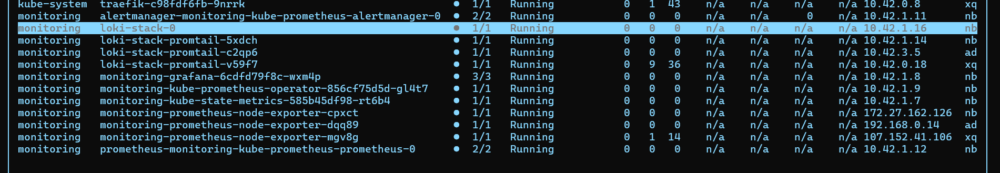

# Definição de Alertas

O Grafana possui uma interface amigável em que é possível definir alertas específicos para a entidade do cluster que deseja observar, fonte de dados, no caso em questão podendo ser Loki ou Prometheus e o filtro desejado. O alerta pode ser configurado para ser enviado por algumas integrações de sistemas de mensagens conhecidos, mas também enviado pelo email configurado.

O alerta definido na prova de conceito envolveu um dos serviços e a observação da métrica de uso de CPU, a regra do alerta seria para quando essa métrica for superior a 80%. A definição do alerta depende do contexto em questão, do que seria o esperado para um serviço e o que pode ser considerado uma anomalia. Como o sistema desenvolvido no trabalho se trata de um trabalho exploratório, foi definido apenas esse alerta, que pode ser visualizado na figura a seguir.

<figure><figcaption></figcaption></figure>

Fonte: Autores. Ferramenta: Grafana (2025).

Ao final da aplicação das boas práticas da Prova de Conceito 4, é possível visualizar todos os pods de monitoramento na figura a seguir.

<figure><figcaption></figcaption></figure>

Fonte: Autores.

