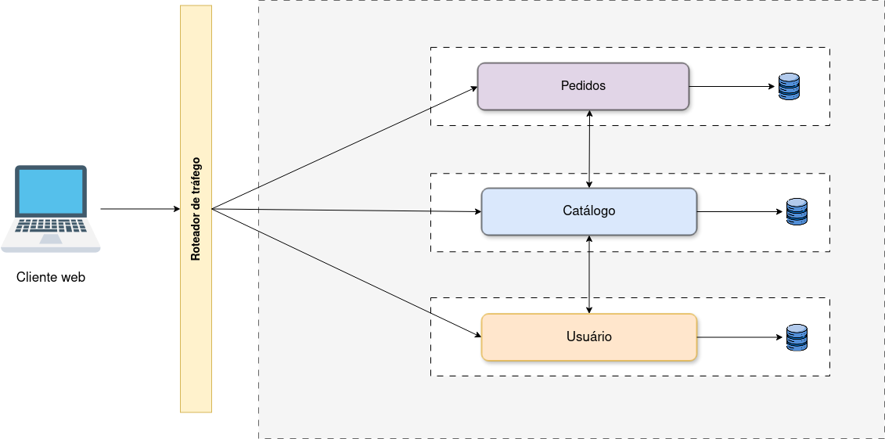
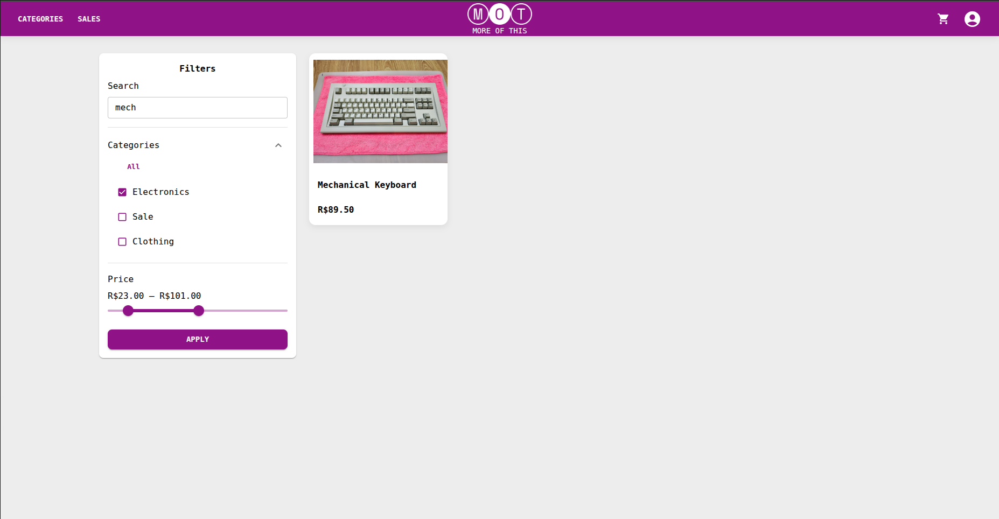

# Sistema - MORE OF THIS

O sistema escolhido para ser desenvolvido como base para a aplicação das Provas de\
Conceito foi o de Comércio Eletrônico, adotado com o nome de "_MORE OF THIS_". Essa\
escolha justifica-se pela facilidade de decomposição do negócio em microsserviços, uma vez\
que suas funcionalidades são modulares e independentes, refletindo as diferentes áreas de\
negócio.

Para o sistema, foi decidida a implementação de 3 serviços de _Back-End_ utilizando da linguagem Python com o Framework FastAPI, e um serviço de _Front-End_ utilizando o React com Typescrip&#x74;_._ Cada um dos serviços possuem as seguintes responsabilidades:&#x20;

* **Serviço de Catálogo de Produtos:** Esse serviço trata de responsabilidades dos produtos e categorias de produtos. Acessível em: [https://github.com/TCC-Adne-e-Gabriel/tcc-catalog](https://github.com/TCC-Adne-e-Gabriel/tcc-catalog) .
* **Serviço de Pedidos e Pagamentos:** Esse serviço apresenta funcionalidades de pedidos e de pagamentos: Acessível em:[https://github.com/TCC-Adne-e-Gabriel/tcc-order](https://github.com/TCC-Adne-e-Gabriel/tcc-order) .
* **Serviço de Usuários:** Responsável por cadastro e _login_ de usuários, assim como informações de endereço. Acessível em: [https://github.com/TCC-Adne-e-Gabriel/tcc-customer](https://github.com/TCC-Adne-e-Gabriel/tcc-customer) .
* _**Front-End:**_ Para realizar a comunicação com os serviços do lado do servidor e apresentar a interface _Web_. Acessível em: [https://github.com/TCC-Adne-e-Gabriel/tcc-front](https://github.com/TCC-Adne-e-Gabriel/tcc-front).

O sistema pode ser acessado pelo seguinte endereço: [https://moreofthis.vercel.app/](https://moreofthis.vercel.app/) .

A Figura a seguir apresenta um diagrama de arquitetura construído para o sistema. Nela é apresentado o cliente, que faz a requisição por meio da aplicação Web (_Front-End_), e a requisição vai para um roteador de tráfego, que leva a chamada para o serviço específico. Cada serviço possui sua própria instância de banco de dados com campos únicos, e esses serviços possuem conexões entre si, como visualizado na figura.

<figure><figcaption></figcaption></figure>

Fonte: Autores

O _Front-End_ da aplicação está dividido entre diversas páginas, que visam proporcionar uma experiência agradável ao usuário e cumprir as funcionalidades do sistema. Nos itens a seguir, estão presentes alguns exemplos de imagens para representar as principais páginas do sistema, em suas versões atuais:

* Página inicial do sistema:&#x20;

<figure><figcaption></figcaption></figure>

* Página de _login_ do sistema:

<figure><figcaption></figcaption></figure>

* Página de Produtos do Sistema:&#x20;

<figure><figcaption></figcaption></figure>

