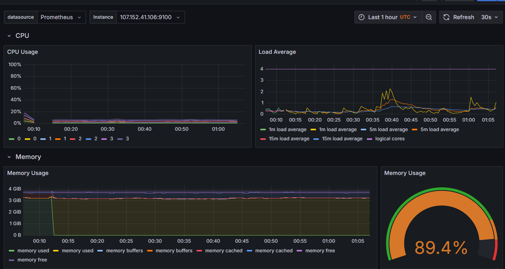

# Sistema - More of This

O sistema escolhido para ser desenvolvido como base de aplicação das Provas de\
Conceito foi o de Comércio Eletrônico, adotado com o nome de "MORE OF THIS". Essa\
escolha justifica-se pela facilidade de decomposição do negócio em microsserviços, uma vez\
que suas funcionalidades são modulares e independentes, refletindo as diferentes áreas de\
negócio.&#x20;

Para o serviço, foi decidida a implementação de 3 serviços de _Back-End_ utilizando da linguagem Python com o Framework FastAPI e um de _Front-End_ utilizando de Reac&#x74;_._ Cada um dos serviços com as seguintes atribuições:&#x20;

* Serviço de Catálogo de Produtos: Esse serviço trata de responsabilidades dos produtos e categorias de produtos. Acessível em: [https://github.com/TCC-Adne-e-Gabriel/tcc-catalog](https://github.com/TCC-Adne-e-Gabriel/tcc-catalog)
* Serviço de Pedidos e Pagamentos: Esse serviço apresenta funcionalidades de pedidos e de pagamentos. [https://github.com/TCC-Adne-e-Gabriel/tcc-order](https://github.com/TCC-Adne-e-Gabriel/tcc-order)
* Serviço de Usuários: Responsabilidades sobre o cadastro e login de usuários, assim como informações de endereço. Acessível em: [https://github.com/TCC-Adne-e-Gabriel/tcc-customer](https://github.com/TCC-Adne-e-Gabriel/tcc-customer)
* _Front-End:_ Para realizar a comunicação com os serviços do lado do servidor. Acessível em: [https://github.com/TCC-Adne-e-Gabriel/tcc-front](https://github.com/TCC-Adne-e-Gabriel/tcc-front).

A Figura a seguir apresenta um diagrama de arquitetura construído para o sistema. Onde apresenta o cliente, que faz a requisição por meio de um cliente (_Front-End_), a requisição vai para um roteador de tráfego, que leva a chamada para o serviço específico.&#x20;

<figure><figcaption></figcaption></figure>

Fonte: Autores

O _Front-End \\_

* Página de home do sistema:&#x20;

<figure><figcaption></figcaption></figure>

* Página de login do sistema;

<figure><figcaption></figcaption></figure>

* Página de Cadastro do Sistema:&#x20;

<figure><figcaption></figcaption></figure>

